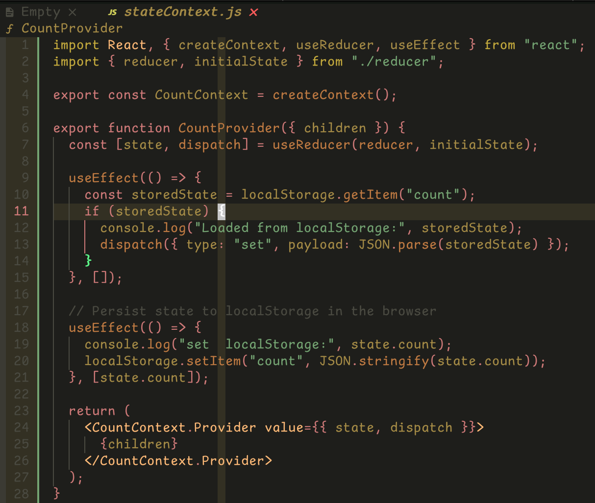

# Redeye

Redeye is a Neovim theme designed to provide a smooth and comfortable experience for your eyes, helping reduce eye strain during long coding sessions. By using primarily red and yellow colors, which have lower frequencies, this theme aims to keep your eyes relaxed, allowing you to code all day and all night without discomfort.



## Installation

### [packer](https://github.com/wbthomason/packer.nvim)

```lua
use 's0ngkran/redeye.nvim'
```

### [vim-plug](https://github.com/junegunn/vim-plug)

```vim
Plug 's0ngkran/redeye.nvim'
```

### [lazy](https://github.com/folke/lazy.nvim)

```lua
{  
   's0ngkran/redeye.nvim',
}
```

## Dev

1. clone this repo

```bash
git clone https://github.com/s0ngkran/redeye.nvim
cd redeye.nvim
```

2. change the directory to the cloned repo

```vim
  {
    dir = '~/projects/redeye.nvim',
    lazy = false,
  },
```

3. restart nvim

## Reload the theme

```vim
:colorscheme redeye
```
